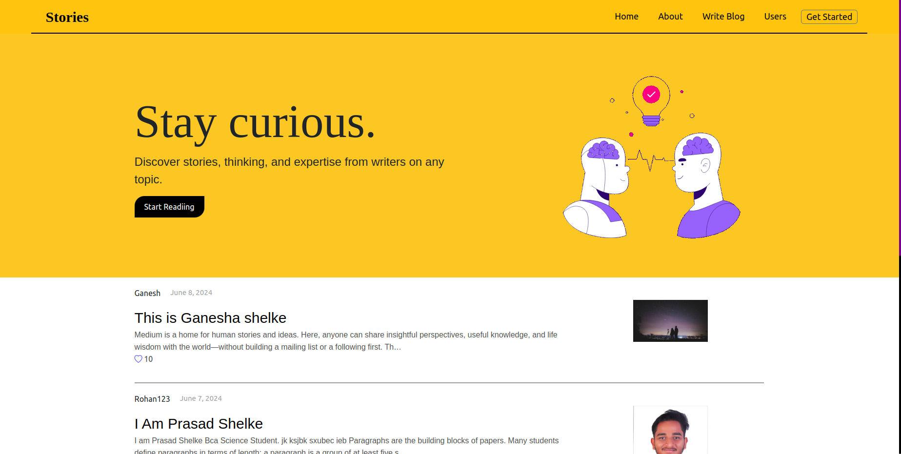
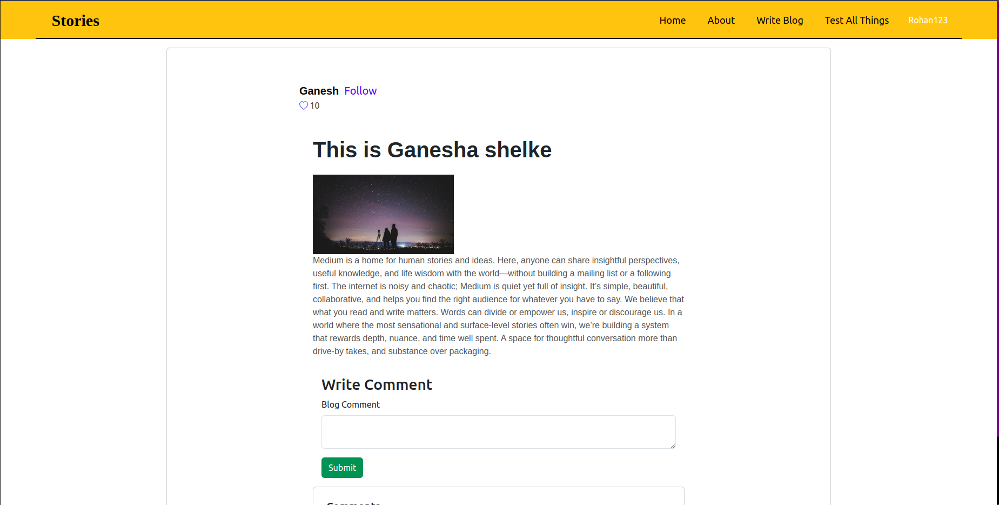
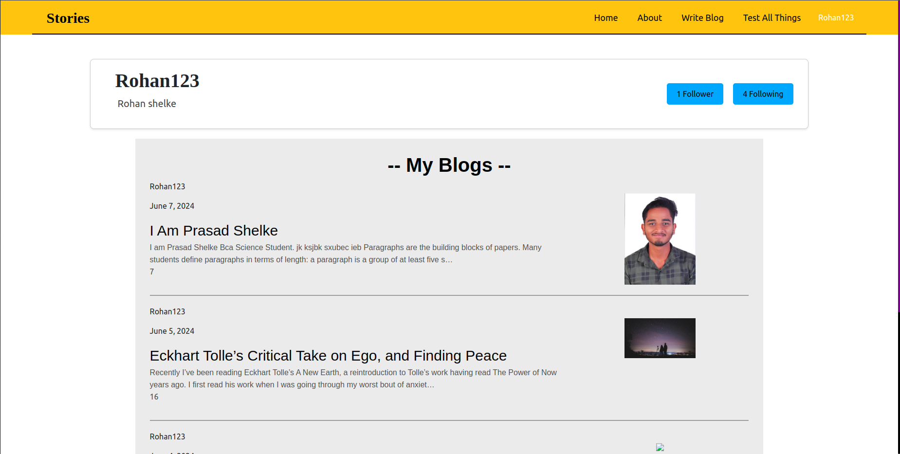

# Blogging Website
# Stories

A fully functional blogging platform where users can create, read, and like blogs, follow other users, and see their posts. This project is built using Django.

[Visit Stories Website](https://stories.pythonanywhere.com/){:target="_blank"}

## Features

- **User Authentication**
  - Register new users
  - Login and logout functionality
- **Blog Management**
  - Create new blog posts
  - Read existing blog posts
  - Like blog posts
  - Comment on blog posts
- **User Interaction**
  - Follow other users
  - View profiles of other users
  - See the list of followers and followings
- **Profile Management**
  - View user profile
  - View the list of blogs created by a user
  - Follow/Unfollow users

 ### Home Page



### Blog Page



### Profile Page


## Setup

### Prerequisites

- Python 3.8.10
- Django 4.2.13
- Virtualenv (optional but recommended)

### Installation

1. **Clone the repository**
   ```sh
   git clone git@github.com:Prasad1102/Stories.git
   cd Stories
